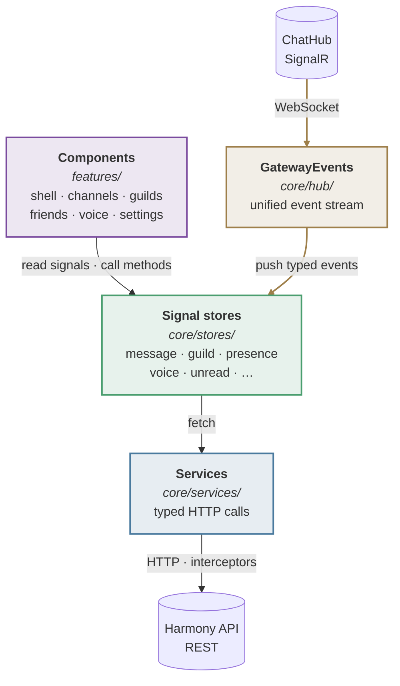
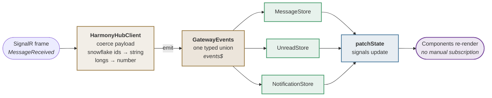

# Harmony Client

Frontend for **Harmony**, a real-time communication platform in the spirit of Discord — guilds,
channels, direct messages, voice/video, presence, and a full permission system.

Built with **Angular 21**, using standalone components, signal-based state, and zoneless change
detection. The backend lives in [`../harmony-api`](../harmony-api).

This is a real-time client first and a CRUD client second. Most of the interesting design decisions
come from that: how live events reach the UI, how optimistic updates reconcile with server truth,
and how the app recovers when the socket drops.

---

## Stack

| Concern | Technology |
|---|---|
| Framework | Angular 21 — standalone components, signals, zoneless |
| State | `@ngrx/signals` signal stores |
| Real-time | `@microsoft/signalr` over WebSocket |
| Voice & video | `livekit-client`, `@livekit/components-core` |
| Styling | Tailwind CSS 4 (PostCSS) |
| UI primitives | Angular CDK — overlays, drag & drop |
| Icons | Font Awesome |
| Testing | Vitest with jsdom |

---

## Architecture

### Layers



Components never call HTTP directly and never touch the socket. They read signals off stores and
call store methods. Everything below that line is the store's problem.

Each store owns exactly one slice of state and **subscribes to the live event stream itself** via
`withHooks(onInit)`. This is deliberate: an earlier design wired every subscription centrally in the
shell component, which meant one file grew a dependency on every feature in the app. Stores that
subscribe to their own events stay self-contained, and a feature can be added without editing shared
wiring.

### The gateway — one stream, not fifty

Every server-to-client message arrives as a single discriminated union, `GatewayEvent`:



`HarmonyHubClient` is the only place that knows about raw SignalR payloads. It registers one handler
per server method, normalises the payload, and emits a typed event. Stores filter by `type` and
patch their own slice.

The event `type` mirrors the backend's `IChatClient` method name exactly, so a single log statement
on the stream traces the entire live pipeline end to end — one of the more useful debugging
affordances in the app.

### Snowflake IDs are strings, always

The backend uses 64-bit snowflake IDs. They exceed `Number.MAX_SAFE_INTEGER`, so `JSON.parse` turns
them into imprecise floats and silently corrupts every subsequent lookup and URL.

Two mechanisms prevent this, because the data arrives over two transports:

- **HTTP** — `bigIntInterceptor` re-parses the raw response text and quotes bare 16-plus-digit
  integers in JSON *value position* before Angular parses it.
- **WebSocket** — `HarmonyHubClient` coerces each ID field with `String()` as it normalises the
  payload.

The interceptor's regex only matches numbers surrounded by JSON structural characters. A naive
"any long digit run" pattern also rewrites digits *inside* string values — such as the path segments
of a presigned upload URL — injecting quotes mid-string and breaking the parse. That bug silently
failed every file upload, and the narrow pattern is what fixes it. Treat every ID as a string.

### Optimistic sending

A sent message renders immediately as a local bubble carrying a **negative placeholder ID** and a
client-generated **nonce**. When the server echo arrives, `MessageStore` matches on the nonce first
and replaces the bubble in place — so it reconciles correctly regardless of whether the socket echo
or the HTTP response wins the race.

Confirmed messages are inserted **by snowflake ID**, not by arrival order. Snowflakes sort
chronologically, so an ID sort *is* the chronological sort, and the rendered stream stays correct no
matter how many API instances are broadcasting concurrently. Unconfirmed bubbles are excluded from
that ordered region — their placeholder IDs are negative and would sort to the top of the channel.

### Interceptor order

Registered in `app.config.ts`, and the order is load-bearing:

```
retryInterceptor  →  authInterceptor  →  bigIntInterceptor
```

`retryInterceptor` is outermost so it retries the whole chain, including an auth refresh-and-retry,
on a transient failure. `bigIntInterceptor` must be last: interceptors run in registration order for
requests and *reverse* order for responses, so the last registered one sees the response body first —
which it must, since it works on raw text before anything parses it.

---

## Getting started

**Prerequisites:** Node.js 20+, and the backend running — see [`../harmony-api`](../harmony-api).

```bash
npm install
npm start
```

The app serves on **http://localhost:4200** and expects the API on **http://localhost:5057**.

Endpoints are configured in [`src/environments/`](src/environments/) — `environment.ts` for
development, `environment.production.ts` for production builds. Both hold the API base URL, the
SignalR hub URL, the LiveKit URL, and the Google OAuth client ID.

> Log in with a seeded account. `dotnet run --project tools/Harmony.DevSeed` in the API repo
> provisions users at every permission tier — open them in separate browser profiles to exercise the
> permission system.

```bash
npm run build     # production build
npm test          # Vitest
npm run watch     # rebuild on change
```

---

## Project layout

```
src/app/
  core/
    hub/           HarmonyHubClient, GatewayEvents — the live event stream
    stores/        signal stores, one per state slice
    services/      typed HTTP wrappers around the API
    models/        DTOs, payload shapes, permission constants
    interceptors/  auth refresh, transient retry, snowflake parsing
    guards/        route guards — authGuard, guestGuard

  features/
    shell/         app frame — sidebars, member list, notifications, toasts
    channels/      message list, composer, attachments, pins, typing
    guilds/        guild view, discovery, invites
    guild-settings/  roles, bans, audit log, guild preferences
    friends/       friends list and requests
    voice/         voice stage, call overlay, tiles, ringing
    settings/      user settings panes
    auth/          login, register, verification, password reset

  shared/
    ui/            presentational primitives — modal, avatar, context menu, …
    directives/    autofocus, auto-grow, resize handle
    util/          markdown, mentions, emoji, snowflake compare, file kinds
```

`core/` is injectable singletons and has no UI. `features/` is routed, lazy-loaded screens.
`shared/` is presentational and depends on neither.

---

## Routing

Routes are lazy-loaded via `loadComponent`. The tree splits three ways:

| Area | Guard | Examples |
|---|---|---|
| Guest-only | `guestGuard` | `/login`, `/register`, `/forgot-password` |
| Authenticated app | `authGuard` | `/app/friends`, `/app/guilds/:id/channels/:id`, `/app/dm/:id` |
| Public landings | none | `/invite/:code`, `/verify-email`, `/reset-password` |

Public landings are deliberately unguarded. They are opened from email clients and shared links,
where the browser may carry no session at all — `/invite/:code` sends guests to login with a
`returnUrl` so the link survives the round trip.

Note that `guilds/:guildId/settings` is declared **before** `guilds/:guildId` so the more specific
path wins.

---

## Real-time behaviour

`SignalRService` owns the connection lifecycle: start, heartbeat, reconnect, and group membership.

It tracks **desired** group membership — the guilds and channel the client *should* be joined to —
separately from what the server currently knows, and re-sends the full set on every reconnect. A
route that activates while the socket is down would otherwise leave the user silently un-joined,
receiving no live events, with nothing visibly wrong.

A heartbeat every 45 seconds keeps the server-side presence TTL (60 seconds) alive. If SignalR's
built-in auto-reconnect gives up entirely, a background timer keeps retrying.

After any reconnect, stores refetch rather than assume they stayed in sync — events that arrived
while the socket was down are gone, and the client cannot know what it missed.

---

## Testing

```bash
npm test
```

Vitest with jsdom. Coverage concentrates on the code where bugs are expensive and hard to see:
store reducers, the gateway's payload coercion, and the pure utilities — markdown rendering, mention
matching, snowflake comparison, emoji shortcodes, file-kind detection.

Components are largely untested by design. The logic worth testing has been pushed out of them.

---

## FAQ / Troubleshooting

**Everything loads, but nothing updates live.**
The socket is down or the client is not in the right groups. Check the connection state and the
WebSocket frames in the Network tab. If HTTP works and only live updates are missing, it is the
socket, not the API.

**An ID lookup fails, or a URL contains a number ending in `00`.**
A snowflake was parsed as a float somewhere. Every ID must be a string end to end — see
[Snowflake IDs are strings](#snowflake-ids-are-strings-always).

**Messages appear briefly, then duplicate or vanish.**
The optimistic bubble failed to reconcile with the server echo. The match runs on the nonce first;
verify one is being sent and echoed back.

**Voice connects but there is no audio, or the camera LED stays on after camera-off.**
Browsers only permit media capture on a secure origin — `localhost` counts, a LAN IP does not. If a
track stops rendering but the device light stays on, the local track was muted rather than stopped.

**A route renders but the sidebar shows me offline.**
Presence for that scope was never loaded. Presence is fetched per visible scope, not globally.

**Build fails on bundle size after adding a dependency.**
The production budget is 1 MB initial. Prefer lazy-loading the feature that needs it over raising
the ceiling.

---

## Development workflow

Branch from `develop` → `feature/*` → pull request → CI must pass → squash merge.

Conventions worth matching: standalone components with no NgModules; signals over RxJS in
components (RxJS stays in services and the gateway); one store per state slice, subscribing to its
own events; and `core` / `features` / `shared` boundaries kept in that dependency direction.
